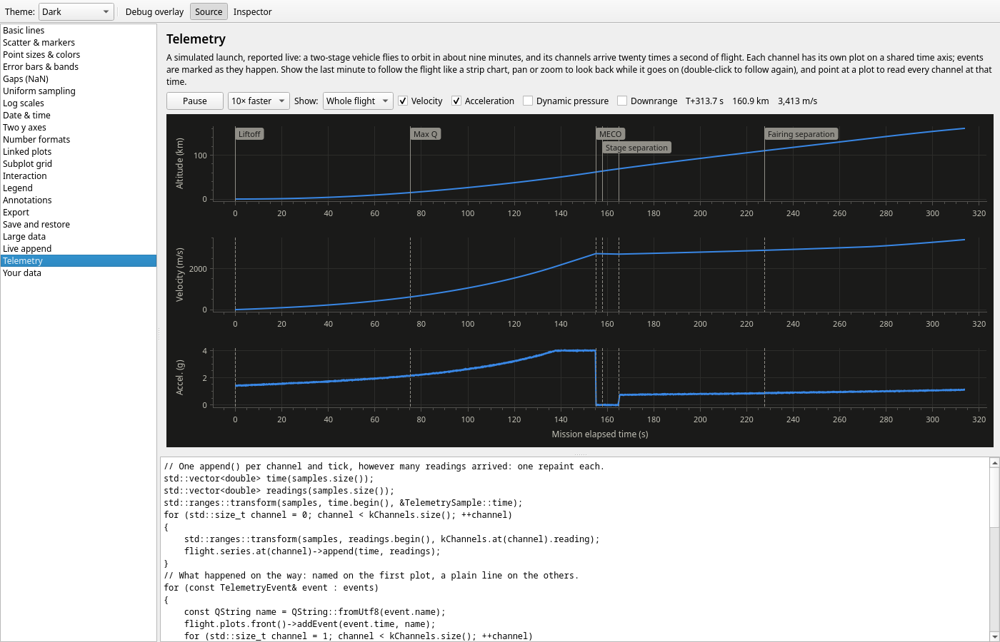
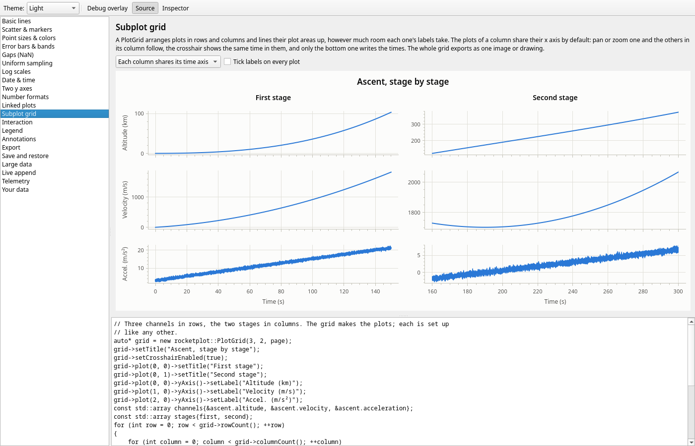

# rocketplot

[](https://github.com/cthunter01/rocketplot/releases/latest)
[](https://github.com/cthunter01/rocketplot/actions/workflows/ci.yml)


A Qt 6 widget for plotting numeric data in C++ applications: any number of data sets on shared axes, with a
legend, taken straight from `std::vector` (or any range of numbers), and smooth to pan and zoom with millions of
points per series. A demo application shows off what it does and is where new features get worked out.



```cpp
#include "rocketplot/Axis.h"
#include "rocketplot/PlotWidget.h"

auto* plot = new rocketplot::PlotWidget(parent);
plot->setTitle("Ascent");
plot->xAxis()->setLabel("Time (s)");
plot->yAxis()->setLabel("Altitude (km)");

std::vector<double> time = ..., stage1 = ..., stage2 = ...;
plot->addLine(time, stage1, "Stage 1");   // copied, as double, from any sized range of numbers
plot->addLine(time, stage2, "Stage 2");

// A uniformly sampled channel needs no x array: x = start + i * step.
plot->addLine(rocketplot::UniformX{.start = 0.0, .step = 1.0 / 1000.0}, samples, "Accelerometer (1 kHz)");

// A second unit on the right; timestamps (seconds since the epoch) as dates and times.
plot->addLine(time, velocity, "Velocity")->setYAxis(plot->yAxis2());
plot->xAxis()->setScaleType(rocketplot::ScaleType::DATE_TIME);

// Uncertainty: a band around a line, bars on scatter points.
plot->addLine(time, estimate, "Estimate")->setYErrors(sigma);
plot->addScatter(pressure, thrust, "Test firings")->setYErrors(below, above);

// Mark it up: a limit, a phase, an event, a note with an arrow.
plot->addHorizontalLine(4.5, "Structural limit");
plot->addVerticalSpan(150.0, 160.0, "Coast");
plot->addEvent(150.0, "MECO");
plot->addText(78.0, 31.4, "Max Q")->setOffset({40.0, -30.0});

// Take it out: a sharp image for a report, a drawing, the data in view.
plot->exportImage("ascent.png", {.size = {600, 400}, .dpi = 300.0});
plot->exportPdf("ascent.pdf", {.theme = rocketplot::Theme::print()});
plot->exportCsv("ascent.csv");

// Open the plot next time the way the user left it: view, legend, hidden series, colors.
QSettings().setValue("ascentPlot", QJsonDocument(plot->saveState()).toJson());
plot->restoreState(QJsonDocument::fromJson(QSettings().value("ascentPlot").toByteArray()).object());

// Several plots as one figure: rows share a time axis, plot areas line up, one export.
auto* grid = new rocketplot::PlotGrid(3, 1, parent);
grid->plot(0)->addLine(time, altitude);
grid->plot(1)->addLine(time, velocity);
grid->plot(2)->addLine(time, acceleration);
grid->exportPdf("flight.pdf");
```

- **Data**: copied in from any range of numbers (`int`, `float`, `std::int16_t`, ...), moved in from an rvalue
  `std::vector<double>`, or plotted in place without a copy (`addLineView`). `append()` adds live data.
  NaN and infinite values are gaps.
- **Large data**: sorted series are drawn from their visible range only, as the extremes of each pixel column,
  read from a precomputed min/max pyramid. 10 million points pan and zoom at interactive frame rates.
- **Errors**: any series takes errors along x and y, the same or different below and above. Lines draw y errors
  as a band and scatter series as bars with caps (either can do both); bars too dense to tell apart become a
  band, read from min/max pyramids like the data. Autoscale makes room for them.
- **Scatter**: seven marker shapes, and a size and color per point for a third and fourth value.
- **Annotations**: reference lines with labels, shaded spans, text with an arrow to the point it is about, and
  event markers whose flags are staggered so neighbors don't cover each other. They move with the data; autoscale
  makes room for the ones you say.
- **Axes**: linear, logarithmic and date/time scales (calendar-aware ticks and concise labels in any time zone),
  a secondary y axis on the right, minor ticks and grid, short labels (a common offset like `+1.7×10⁹`, a `×10ⁿ`
  multiplier, or SI prefixes), and Qt rich text in titles and labels (`v<sub>z</sub>`).
- **Autoscale**: fit all the data, fit y to what's visible in the current x range, or follow the newest data
  as a scrolling strip chart.
- **Linked plots**: `PlotLink` ties the x axes of stacked plots together, lines up their plot areas, and shares
  their crosshair and view history.
- **Subplot grid**: `PlotGrid` arranges plots in rows and columns, lines their plot areas up in both directions,
  links the x axes of each column (or of all plots, or none), leaves the tick labels of a shared axis to the
  bottom row, and exports as one figure.
- **Qt Designer**: a plugin puts `PlotWidget` and `PlotGrid` into Designer's widget box, with their properties in
  the property editor (see [Qt Designer](#qt-designer)).
- **Interaction**: drag to pan, Shift-drag to zoom to a box (a thin one zooms one axis), wheel to zoom about the
  pointer (over an axis: only that axis; Ctrl: x only, Shift: y only), double-click to autoscale again. Trackpads
  scroll to pan and pinch to zoom; touchscreens drag and pinch. Back and forward through the view history (the
  mouse's side buttons, the context menu, or `back()`/`forward()`), a crosshair with its coordinates on the axes,
  and a context menu you can add to. `InputBindings` remaps which gesture does what.
- **Legend**: goes where it hides the least data, or where you drag it. Click an entry to hide its series,
  double-click to show it alone, point at it to bring its series forward, right-click it to change its color,
  width or marker. With the crosshair on, each entry reads its series at the pointer.
- **Export**: an image at any size and sharpness (a 600 × 400 plot at 300 dpi), SVG and PDF drawings with text
  kept as text, the clipboard, and the data in view as CSV. An export looks like the widget, without the
  crosshair, or takes a theme of its own: print-ready figures from a dark window. The context menu has Copy
  image and Export… .
- **State**: `saveState()` gives how a plot is set up (axis ranges, scales and grids, the legend's place, each
  series' visibility and style, found again by name) as JSON, and `restoreState()` applies it to a plot with the
  same or newer data. Settings that follow the theme keep following it.
- **Look**: light and dark themes that follow the application's palette, plus high-contrast and print themes; a
  colorblind-safe series palette, hairline grid, tabular tick labels. A debug overlay shows layout boxes, frame
  time and what each series drew.
- MIT licensed; needs only Qt.



Run the demo to see it: `build/clang-debug/bin/rocketplot_demo` after building. Besides a gallery page per
feature (each with its source), it has an inspector that shows and edits every property of the page's plots, a
simulated launch reported as live telemetry, and a page for your own data: open a CSV file, drop one on the
window, paste cells copied from a spreadsheet, or start it with `rocketplot_demo data.csv`.

### Use it in your project
Install it (`cmake --install build/<preset> --prefix <dir>`) or download the `-sdk` release archive, then:
```cmake
find_package(rocketplot 0.1 REQUIRED)   # with <dir> in CMAKE_PREFIX_PATH
target_link_libraries(my_app PRIVATE rocketplot::rocketplot)
```
Or build it with your project through `FetchContent` or `add_subdirectory()`.

### Qt Designer
The build makes a Designer plugin when Qt's UiPlugin module is there (it comes with Qt's tools; Arch:
`qt6-tools`): `build/<preset>/plugins/designer/rocketplot_designer.so` (`.dll` on Windows), also installed to
`<prefix>/plugins/designer/` and part of the `-sdk` archives. Designer looks for plugins in a `designer` folder of
its plugin paths:
```sh
QT_PLUGIN_PATH=build/clang-debug/plugins designer6      # try it from the build
cp build/clang-debug/plugins/designer/rocketplot_designer.so <Qt>/plugins/designer/   # or keep it with Qt
```
"Plot" and "Plot grid" then show under *rocketplot* in the widget box. A form that uses them includes
`rocketplot/PlotWidget.h` or `rocketplot/PlotGrid.h`, so the application links `rocketplot::rocketplot` as
above; the data, axis labels and so on are set in code (`ui->plot->addLine(...)`). A plugin must be built with
the Qt it is loaded by (same major version, not newer than it, same compiler family). Qt Creator's built-in
form editor uses the Qt that Creator itself was built with, which is often not the one your kit uses: if the
widgets don't show up there, open the form in the standalone Designer of your Qt (or promote a `QWidget` to
`rocketplot::PlotWidget` by hand; the generated code is the same).

## Requirements
- Qt 6.8 or later (Widgets and SVG; Qt's tools too for the Designer plugin). On Linux and FreeBSD, from the
  system's packages (`qt6-base qt6-svg`, and `qt6-tools`, on Arch and FreeBSD alike); on macOS and Windows, from the
  [Qt online installer](https://www.qt.io/download-qt-installer) or
  [aqt](https://github.com/miurahr/aqtinstall), with its prefix in `CMAKE_PREFIX_PATH` (e.g. in a
  `CMakeUserPresets.json`)
- CMake 3.28+ and Ninja
- A C++23 compiler with `<print>`:
  - Linux: GCC 14+ or Clang 18+
  - macOS: Xcode 16.3+ or its Command Line Tools (Apple Clang 17+)
  - Windows: Visual Studio 2022 17.7+ (MSVC) with the "Desktop development with C++" workload
  - FreeBSD: 15+, with the base system's Clang (`pkg install cmake-core ninja git-lite` for the rest)
- Optional: clang-tidy, clang-format, llvm-cov/llvm-profdata (coverage), Doxygen (docs), ccache.
  On macOS, clang-tidy comes from Homebrew (`brew install llvm`). Coverage uses Xcode's llvm-cov.

GoogleTest and Google Benchmark are used from the system when installed, otherwise downloaded at configure
time.

## Build
Linux, macOS and FreeBSD:
```sh
cmake --workflow --preset dev          # configure + build + test, Clang Debug
./build/clang-debug/bin/rocketplot_demo
```

Windows, from a **Developer PowerShell for VS** (Ninja needs MSVC's environment; VS Code's CMake Tools and
Visual Studio set it up themselves):
```powershell
cmake --workflow --preset dev-msvc     # configure + build + test, MSVC Debug
.\build\msvc-debug\bin\rocketplot_demo.exe   # with Qt's bin directory on PATH
```

The demo can also save a screenshot of every page and quit, without a display:
`QT_QPA_PLATFORM=offscreen ./build/clang-debug/bin/rocketplot_demo --theme dark --screenshots shots/`
(`--inspector` shows the property inspector in them, `--settle 8000` gives the live pages eight seconds each,
`--page Telemetry` takes only that page; `--help` lists the options).

| Preset | Platforms | What it is |
| --- | --- | --- |
| `clang-debug`, `clang-release` | Linux, macOS, FreeBSD | Everyday builds (Apple Clang on macOS) |
| `gcc-debug`, `gcc-release` | Linux | Everyday builds |
| `msvc-debug`, `msvc-release` | Windows | Everyday builds |
| `asan` | Linux, macOS | Clang Debug with AddressSanitizer + UndefinedBehaviorSanitizer |
| `tsan` | Linux, macOS | Clang RelWithDebInfo with ThreadSanitizer |
| `tidy` | Linux, macOS | Clang Debug running clang-tidy on every file; findings are errors |
| `coverage` | Linux, macOS | `cmake --workflow --preset coverage` writes `build/coverage/coverage/html/index.html` |
| `bench` | Linux, macOS | Clang Release with the benchmarks (see [Benchmarks](#benchmarks)) |
| `ci-gcc`, `ci-clang`, `ci-msvc` | as their compiler | Release builds with warnings as errors, as run in CI (`ci-clang` and `ci-msvc` build rocketplot as a shared library) |
| `dist-linux`, `dist-macos`, `dist-windows` | Linux, macOS, Windows | The release archives (see [Releases](#releases)) |

A preset exists only on the platforms it supports; `cmake --list-presets` shows the ones for this machine.
Each workflow preset (`dev`, `dev-msvc`, `ci-gcc`, `ci-clang`, `ci-msvc`, `asan`, `tsan`, `tidy`, `coverage`)
configures, builds and tests in one command, and the `dist-*` ones also package. Separate steps:
`cmake --preset <p>`, `cmake --build --preset <p>`, `ctest --preset <p>`.

CI (GitHub Actions) builds and tests on all four: Linux (`ci-gcc`, `ci-clang`, `asan`, `tidy`), macOS
(`ci-clang`), Windows (`ci-msvc`) and FreeBSD (`ci-clang`, in a VM). The sanitizer, tidy and coverage presets are
not checked on FreeBSD.

API docs: `cmake --build --preset clang-debug --target docs`, then open `build/clang-debug/docs/html/index.html`.

### Benchmarks
```sh
cmake --workflow --preset bench                                     # configure + build, Clang Release
./build/bench/bin/rocketplot_benchmarks                             # the widget: frames, adding data
./build/bench/bin/rocketplot_core_benchmarks                        # the Qt-free core: decimation, append, ...
./build/bench/bin/rocketplot_benchmarks --benchmark_filter=Render   # some of them
```
`Render/...` times a whole frame of a 1600 × 900 plot (layout, decimation and painting, on Qt's offscreen
platform): 16 ms is 60 frames a second. Elsewhere, `-DROCKETPLOT_BUILD_BENCHMARKS=ON` adds the benchmarks to any
build; the CI presets have it on and run each benchmark once as a test (`ctest -L bench`), so that they keep
working.

## Releases
The Release workflow (`.github/workflows/release.yml`) runs only when started by hand, never on a push:
1. Raise `VERSION` in `project()` in `CMakeLists.txt`, then commit and push.
2. Start it from the Actions tab (Release > Run workflow, pick the branch) or with `gh workflow run release.yml`
   (`-f prerelease=true` marks it a pre-release).

It stops at once if the tag `v<version>` already exists. Otherwise it runs all of CI and builds, tests and
packages an archive on each platform. Only when every job passes does it tag the commit `v<version>` and
publish a GitHub release with the archives, a `SHA256SUMS` file and generated release notes.

Each platform gets two archives: `rocketplot-<version>-<platform>-sdk` (the static library, headers and CMake
package, for `find_package(rocketplot)`, and the Designer plugin) and `rocketplot-<version>-<platform>-demo` (the
demo, with the Qt libraries and plugins it needs next to it).

| Platform | Built with | Runs on |
| --- | --- | --- |
| `linux-x86_64` (`.tar.gz`) | GCC 14, Ubuntu 24.04, Qt 6.8 | x86-64 Linux with glibc 2.39+ (Ubuntu 24.04+, Debian 13+, Fedora 40+, RHEL 10+). The demo also needs OpenGL, fontconfig and `libxcb-cursor0` |
| `macos-universal` (`.tar.gz`) | Apple Clang, Qt 6.10 | macOS 14+, Apple silicon and Intel |
| `windows-x86_64` (`.zip`) | MSVC, Qt 6.8 | 64-bit Windows (the VC++ runtime DLLs are included) |

Qt is used under the LGPL-3.0 (see `QT_LICENSE.txt` in the demo archive). Other dependencies are built from source,
never taken from the build machine. An archive holds what the `install()` rules install.
Build one with `cmake --workflow --preset dist-macos` (or `dist-windows`); it lands in `build/dist-<os>/package/`.
`dist-linux` needs a Qt from the Qt installer or aqt: it refuses a distribution's Qt in `/usr`, which can't be
deployed (it would copy the whole system), so on Arch it runs in CI only.

The executables are not code-signed. A macOS browser download needs
`xattr -d com.apple.quarantine rocketplot_demo.app` before it runs, and Windows SmartScreen warns the first time.

## License
MIT; see [LICENSE](LICENSE).
