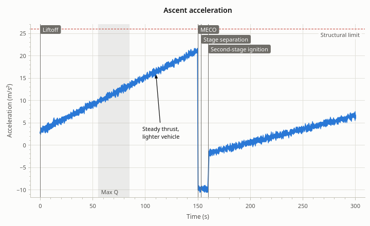

# Annotations

[User Guide](index.md) · previous: [Axes](axes.md) · next: [Interaction](interaction.md)

Annotations mark up the data: a limit, a phase, a remark, an event. They sit at data coordinates and move with
the data as the view is panned and zoomed. They have no legend entry.



<!-- example: annotations -->
```cpp
// A value that matters: a line across the plot, with a label.
rocketplot::ReferenceLine* limit = plot->addHorizontalLine(26.0, "Structural limit");
limit->setColor(QColor("#c0392b"));
limit->setIncludedInAutoscale(true);  // keep it in view though the data stays below it

// A stretch of time: shaded from top to bottom, under the data.
plot->addVerticalSpan(55.0, 85.0, "Max Q");

// Things that happened: a line each, named on a flag.
plot->addEvent(0.0, "Liftoff");
plot->addEvent(150.0, "MECO");
plot->addEvent(153.0, "Stage separation");
plot->addEvent(160.0, "Second-stage ignition");

// A remark about a point of the data, set off from it with an arrow.
rocketplot::TextAnnotation* note =
    plot->addText(110.0, 16.3, "Steady thrust,<br>lighter vehicle");
note->setOffset({10.0, 100.0});                       // pixels: right and down
note->setAlignment(Qt::AlignHCenter | Qt::AlignTop);  // the middle of the text's top goes there
```

| Kind | Made by | What it is |
| --- | --- | --- |
| `ReferenceLine` | `addHorizontalLine(y, label)`, `addVerticalLine(x, label)` | A line across the whole plot at one value |
| `ShadedSpan` | `addHorizontalSpan(yMin, yMax, label)`, `addVerticalSpan(xMin, xMax, label)` | A filled band between two values |
| `TextAnnotation` | `addText(x, y, text)` | Text at a point, optionally set off from it with an arrow |
| `EventMarker` | `addEvent(x, label)` | A vertical line with its name on a flag at the top |

Like series, annotations are made and owned by the plot, which returns a pointer to set them up with.

## Reference lines

A line at a value that matters: a limit, a target, "now".

<!-- example: annotations-lines -->
```cpp
rocketplot::ReferenceLine* target = plot->addHorizontalLine(200.0, "Target orbit");
target->setLineStyle(Qt::SolidLine);  // dashed by default
target->setLineWidth(2.0);
target->setLabelAlignment(Qt::AlignLeft | Qt::AlignBottom);  // left end, below the line
target->setValue(210.0);                                     // move it

plot->addVerticalLine(42.0);  // at an x value, without a label
```

The label alignment says at which end of the line the label sits and on which side of it. For a horizontal line:
`Qt::AlignLeft`, `Qt::AlignHCenter` or `Qt::AlignRight` along it, and `Qt::AlignTop` (above) or `Qt::AlignBottom`
(below). For a vertical line it is the other way round: `Qt::AlignTop`, `Qt::AlignVCenter` or `Qt::AlignBottom`
along it, and `Qt::AlignLeft` or `Qt::AlignRight` of it. The default is above the right end of a horizontal line
and right of the top of a vertical one. Where the label wouldn't fit inside the plot on its side, it changes
sides.

## Shaded spans

A span fills the plot between two values, from edge to edge in the other direction.

<!-- example: annotations-spans -->
```cpp
rocketplot::ShadedSpan* coast = plot->addVerticalSpan(150.0, 160.0, "Coast");
coast->setColor(QColor("#2980b9"));
coast->setOpacity(0.2);  // of the fill; 0.12 by default

// Between two y values: an allowed band. An infinite end runs to the plot's edge.
plot->addHorizontalSpan(-std::numeric_limits<double>::infinity(), 0.0, "Below zero");
```

Spans are drawn under the series, so the data stays readable through them. Their label is inside the span, at the
bottom left by default, clear of the event flags along the top; `setLabelAlignment()` moves it.

## Text

Text at a point of the data. Left at the point, it labels it; moved away by an offset, it gets an arrow that
points back at the point.

<!-- example: annotations-text -->
```cpp
rocketplot::TextAnnotation* peak = plot->addText(78.0, 31.4, "Max Q");
peak->setOffset({40.0, -30.0});     // 40 px right of the point, 30 px above it
peak->setArrowVisible(false);       // no arrow back to the point
peak->setBackgroundVisible(false);  // no box behind the text
peak->setText("q<sub>max</sub>");   // rich text
peak->setPosition(79.5, 31.9);      // the point it is about, in data coordinates
```

- The **position** is in data coordinates, so the note stays with its point as the view changes.
- The **offset** is in pixels (x to the right, y downward), so the note stays the same distance from its point at
  any zoom.
- The **alignment** says which part of the text is put there: `Qt::AlignCenter` (the default) centers it,
  `Qt::AlignLeft | Qt::AlignBottom` puts its bottom-left corner there, so that the text runs up and to the right.
- The text has a box in the plot's background color behind it by default, which keeps it readable over the grid
  and the data.

## Event markers

Something that happened at one x: a vertical line with a flag.

Events often come in bunches (main engine cutoff, stage separation and second-stage ignition within seconds), so
their flags are staggered onto rows: a flag that would cover its neighbor goes one row down, as in the figure at
the top. When there are more events than the rows that fit, the flags without room are left out until the view is
zoomed in; their lines stay.

An event without a label is only the line.

## Common settings

Every annotation has these.

<!-- example: annotations-common -->
```cpp
rocketplot::Annotation* any = peak;
any->setVisible(false);
any->setColor(Qt::darkGreen);  // of a line, a span's fill, a flag; resetColor() undoes it
any->setLayer(rocketplot::AnnotationLayer::BELOW_SERIES);  // under the data
any->setYAxis(plot->yAxis2());                             // its y values are on the right axis
any->setIncludedInAutoscale(true);                         // autoscale makes room for it

plot->removeAnnotation(any);  // deletes it
plot->clearAnnotations();     // all of them
```

- **Color.** Without one, an annotation uses the theme's annotation color (text: the theme's text color), which
  follows the theme.
- **Layer.** Spans start below the series; lines, text and events above. Labels are always drawn above the data.
- **y axis.** The y values of a horizontal line, a horizontal span and a text are on the left axis unless set to
  the right one.
- **Autoscale.** Off by default: annotations don't change what the axes show. Turn it on for a limit line that
  must stay in view even when all the data is far below it.

`plot->annotations()` lists them all. The plot emits `annotationAdded()` and `annotationRemoved()`.

Annotations are part of exports ([Export](export.md)) but not of the saved state ([State](state.md)): like data,
they are something your code puts there.

Next: [Interaction](interaction.md).
