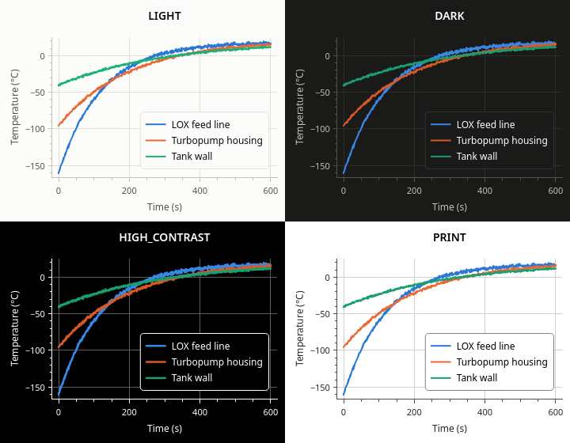
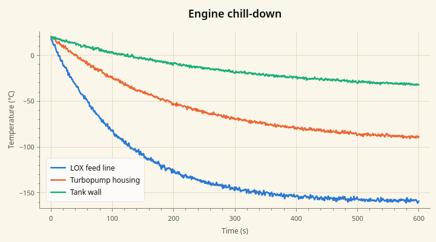
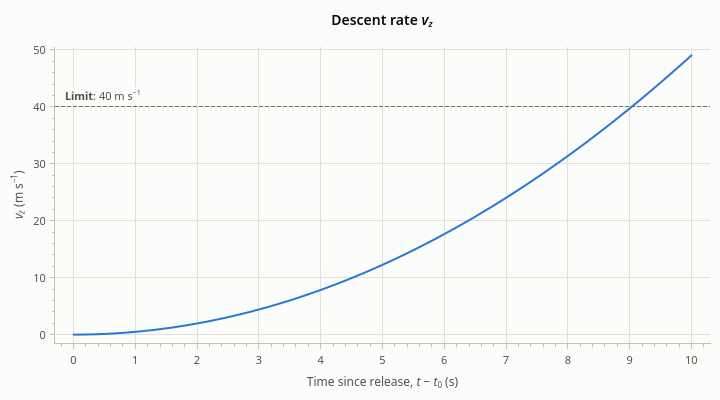

# Appearance

[User Guide](index.md) · previous: [Several plots](multiple-plots.md) · next: [Export](export.md)

How a series looks is set on the series ([Series](series.md)). Everything else a plot draws (background, axes,
grid, text, the legend's box, the palette that series colors come from) is its *theme*.

## The built-in themes



| Mode | The theme |
| --- | --- |
| `SYSTEM` (the default) | Light or dark, to match the application's palette, and it follows when the palette changes |
| `LIGHT`, `DARK` | Always that one |
| `HIGH_CONTRAST` | White on black, nothing translucent, stronger grid, heavier lines and markers: for low vision and bright rooms |
| `PRINT` | Black on pure white with axes and grid dark enough to print, and series colors that hold up on paper |
| `CUSTOM` | The theme you gave to `setTheme()` |

<!-- example: appearance-mode -->
```cpp
plot->setThemeMode(rocketplot::ThemeMode::DARK);    // always dark
plot->setThemeMode(rocketplot::ThemeMode::SYSTEM);  // the default: follows the desktop
```

With `SYSTEM`, a plot in an application that follows the desktop's dark mode switches with it, and so do the
series that use theme colors. A plot in an application with a palette of its own matches that palette. You rarely
need to set a mode at all.

The series palettes of the light and dark themes are not the same colors: each hue has a step chosen for its
background, so that a line is as easy to see on dark as on light.

To export a plot from a dark window for a document, don't switch the plot's theme: give the export one. See
[Export](export.md#size-sharpness-and-theme).

## A theme of your own

A `Theme` is a plain struct of colors and sizes. Start from a built-in one and change what you need.



<!-- example: appearance-custom -->
```cpp
rocketplot::Theme theme = rocketplot::Theme::light();  // start from a built-in theme
theme.background        = QColor("#fbf6ea");
theme.gridLine          = QColor("#e6dcc6");
theme.axisLine          = QColor("#8a7f6a");
theme.lineWidth         = 2.5;  // of every line that wasn't given a width of its own
theme.titleFontScale    = 1.5;  // times the widget's font
plot->setTheme(theme);          // the mode is now ThemeMode::CUSTOM
```

The fields:

| Field | What it colors or sizes |
| --- | --- |
| `background` | Behind everything |
| `text`, `secondaryText` | Title and legend text; axis labels and tick labels |
| `axisLine`, `gridLine`, `minorGridLine` | Axis lines and ticks; the grid at major ticks; at minor ticks |
| `legendBackground`, `legendBorder` | The legend's box |
| `crosshair`, `tagBackground`, `tagText` | The crosshair and its value tags on the axes |
| `zoomBoxBorder`, `zoomBoxFill` | The box dragged out to zoom |
| `annotation` | Reference lines, spans and event markers without a color of their own |
| `seriesColors` | The colors series get, in order; with more series than colors it starts over |
| `lineWidth`, `markerSize`, `markerRingWidth` | Defaults for series: 2, 8 and 2 pixels |
| `errorBarWidth`, `errorCapSize`, `bandOpacity` | Defaults for errors: 1.5 and 6 pixels, 0.15 |
| `annotationLineWidth`, `spanOpacity` | Defaults for annotations: 1 pixel, 0.12 |
| `tickLength`, `minorTickLength` | 5 and 3 pixels |
| `tickFontScale`, `labelFontScale`, `titleFontScale`, `annotationFontScale` | Font sizes as factors of the widget's font: 0.9, 1.0, 1.2, 0.9 |

Sizes are in device-independent pixels.

If you replace `seriesColors`, test the colors: neighbors in the list must be easy to tell apart, also for
readers with a color vision deficiency, and each must stand out from your background. The built-in palettes were
checked for this.

A custom theme does not follow the system's dark mode. If your application has both, make two themes and set the
right one when the palette changes (`QEvent::ApplicationPaletteChange`).

The theme in use can be read back, which is handy for drawing something of your own next to a plot in matching
colors.

<!-- example: appearance-read -->
```cpp
// The colors the plot draws with now, for things drawn beside it.
const rocketplot::Theme& current    = plot->theme();
const QColor             background = current.background;
const QColor             firstColor = current.seriesColor(0);
```

`themeChanged()` is emitted when it changes, also when a `SYSTEM` plot follows the palette.

## Fonts

A plot draws its text in its widget font: the application's font unless you set another. The theme scales it for
tick labels, axis labels and the title.

<!-- example: appearance-font -->
```cpp
QFont font = plot->font();
font.setPointSizeF(11.0);  // or setFamily(), setWeight(), ...
plot->setFont(font);       // tick labels, axis labels, the title and the legend all follow
```

So there are two knobs: the widget's font for the family and the overall size, and the theme's font scales for
the sizes of the parts relative to each other.

Tick labels are drawn with tabular digits where the font has them, so that numbers line up and don't shift as
values change.

## Rich text

Titles, axis labels, legend names and annotation texts can be Qt rich text: a small subset of HTML. This is
mostly for subscripts, superscripts and italic symbols.



<!-- example: appearance-rich-text -->
```cpp
plot->setTitle("Descent rate <i>v<sub>z</sub></i>");
plot->xAxis()->setLabel("Time since release, <i>t</i> − <i>t</i><sub>0</sub> (s)");
plot->yAxis()->setLabel("<i>v<sub>z</sub></i> (m s<sup>−1</sup>)");
plot->addHorizontalLine(40.0, "<b>Limit</b>: 40 m s<sup>−1</sup>")
    ->setLabelAlignment(Qt::AlignLeft | Qt::AlignTop);  // above the line's left end
```

Useful tags: `<sub>`, `<sup>`, `<i>`, `<b>`, and `<br>` for a line break. A string is treated as rich text when
it looks like it (Qt's `Qt::mightBeRichText()`); in rich text, write a literal `<` as `&lt;` and `&` as `&amp;`.

Many symbols need no markup at all: the strings are Unicode, so `"Temperature (°C)"`, `"m/s²"` and `"Δv"` work
as they are, provided the source file is UTF-8.

## High-DPI screens

Every size in the API (line widths, marker sizes, offsets, export sizes) is in device-independent pixels, the
unit Qt uses for widget geometry. On a screen with a scale factor of 2 a 2-pixel line covers 4 physical pixels and
is drawn at the full resolution. You don't have to do anything for it.

Next: [Export](export.md).
