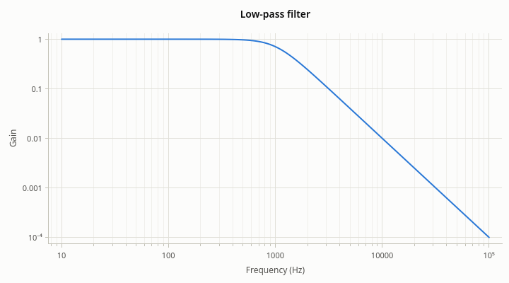
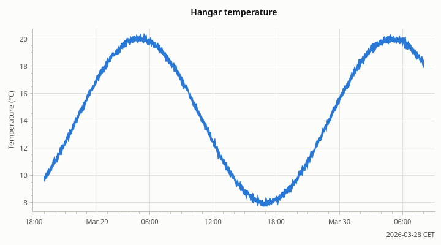
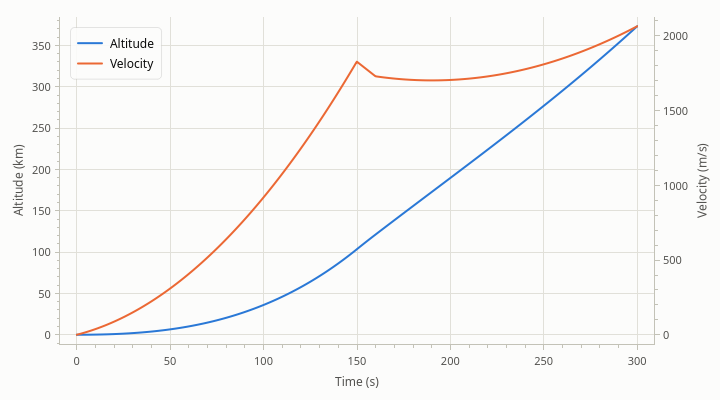
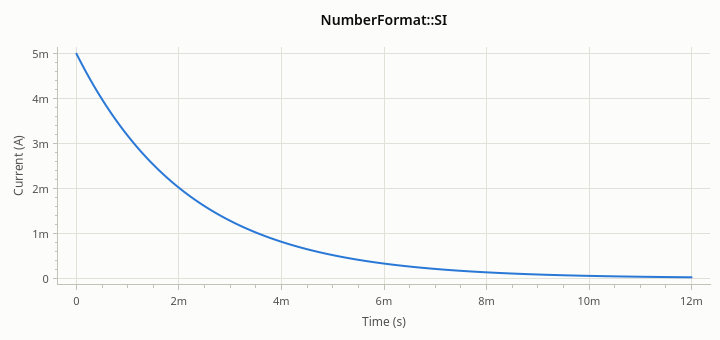
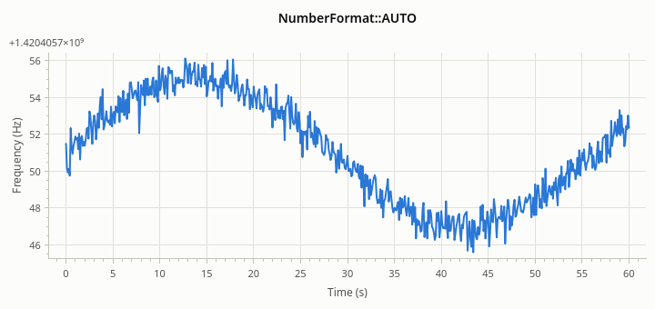

# Axes

[User Guide](index.md) · previous: [Series](series.md) · next: [Annotations](annotations.md)

A plot has three axes: `xAxis()` along the bottom, `yAxis()` on the left, and `yAxis2()` on the right, which shows
up once a series uses it. Each is an `Axis` with a range, a scale, labels and a grid.

## Range and autoscale

An axis is in one of two states.

- **Autoscale on** (the start): the range follows the data. Add points and the axis makes room.
- **Autoscale off**: the range stays where it was put, by the user or by your code.

Setting a range turns autoscale off for that axis. So does the user, by panning or zooming. Turning autoscale back
on fits the data at once.

<!-- example: axes-range -->
```cpp
rocketplot::Axis* x = plot->xAxis();
x->setRange(100.0, 200.0);  // show this stretch; turns autoscale off for the axis
const rocketplot::Range shown = x->range();  // {.min = 100, .max = 200}

x->setAutoscale(true);  // follow the data again
plot->resetView();      // or: every axis back to autoscale
```

A double-click on the plot calls `resetView()`.

A range that can't be shown is ignored: one that isn't finite, one too small for `double` to tell its ends apart,
or one that isn't positive on a logarithmic axis. If the ends are the wrong way round they are swapped; an axis
always runs from its smaller value to its larger one.

### Autoscale

What "follows the data" means is the axis's autoscale mode.

| Mode | For | The axis shows |
| --- | --- | --- |
| `FIT_ALL` (the default) | x and y | All the data of the visible series, plus a margin |
| `FIT_VISIBLE` | y | The data inside the current x range: zoom into a time span and y fits what is there |
| `FOLLOW_LATEST` | x | The newest `followWindow()` of data, scrolling as more arrives |

<!-- example: axes-autoscale -->
```cpp
// All the data, with 10% of its span left free on each side (3% by default).
plot->yAxis()->setAutoscaleMode(rocketplot::AutoscaleMode::FIT_ALL);
plot->yAxis()->setAutoscaleMargin(0.10);

// y fits what is inside the current x range: zoom into a time span and y follows.
plot->yAxis()->setAutoscaleMode(rocketplot::AutoscaleMode::FIT_VISIBLE);

// x shows the newest 30 units of data and scrolls as more is appended.
plot->xAxis()->setAutoscaleMode(rocketplot::AutoscaleMode::FOLLOW_LATEST);
plot->xAxis()->setFollowWindow(30.0);
```

- The **margin** is a fraction of the data's span, left free on each side, so that the curve doesn't touch the
  frame. 0.03 by default; 0 for none.
- The **follow window** is in the units of the axis: seconds on a time axis. 10 by default.
- Autoscale fits visible series only, and their errors too. Annotations are fitted only if you ask
  ([Annotations](annotations.md#common-settings)).
- `FIT_VISIBLE` and `FOLLOW_LATEST` together make a strip chart; see [Live data](data.md#live-data).

### Knowing when the view changes

<!-- example: axes-signals -->
```cpp
QObject::connect(plot->xAxis(), &rocketplot::Axis::rangeChanged, rangeLabel,
                 [rangeLabel](double min, double max) {
                     // The user panned or zoomed, autoscale moved the axis, or code set it.
                     rangeLabel->setText(QString("%1 s to %2 s").arg(min).arg(max));
                 });
```

`rangeChanged` comes from one axis. `PlotWidget::viewChanged()` is emitted when the range of any of the plot's
axes changes, which is what a status bar or a second view of the same data wants.

## Logarithmic scale

On a logarithmic axis each power of ten takes the same length.



<!-- example: axes-log -->
```cpp
plot->addLine(frequency, gain);
plot->xAxis()->setScaleType(rocketplot::ScaleType::LOGARITHMIC);
plot->yAxis()->setScaleType(rocketplot::ScaleType::LOGARITHMIC);
plot->xAxis()->setMinorGridVisible(true);  // the 2, 3, ... 9 between the powers of ten
```

Values that are zero or negative have no place on a logarithmic axis. Points with such a value are not drawn
(the line breaks, as at a gap), and autoscale fits the positive values only. Switching an axis to logarithmic while
its range includes zero or negative values turns autoscale back on.

## Dates and times

A `DATE_TIME` axis takes x values that are seconds since 1970-01-01 00:00 UTC (Unix time), as a `double`, and
labels them as dates and times.



<!-- example: axes-time -->
```cpp
// x values are seconds since 1970-01-01 00:00 UTC, as a double.
plot->addLine(seconds, temperature);
plot->xAxis()->setScaleType(rocketplot::ScaleType::DATE_TIME);
plot->xAxis()->setTimeZone(QTimeZone("Europe/Berlin"));  // UTC unless told otherwise
```

The ticks land on calendar boundaries (whole minutes, hours, days, months) in the axis's time zone, and the
labels say only what changes from tick to tick; the rest of the date is written once at the end of the axis. Zoom
in and the labels go from months to days to hours to seconds and fractions of a second.

To convert to and from axis values, include `"rocketplot/plottime.h"`:

<!-- example: axes-time-values -->
```cpp
const QDateTime liftoff(QDate(2026, 3, 28), QTime(18, 30), QTimeZone::UTC);
const double    x    = rocketplot::toPlotTime(liftoff);  // what the axis takes
const QDateTime back = rocketplot::fromPlotTime(x);      // and back, in UTC
```

`toPlotTime()` also takes a `std::chrono::system_clock` time point.

A `double` holds Unix times of today to about a microsecond. For data sampled faster than that over a short time,
plot seconds since the start on a linear axis instead.

## A second y axis

Two series measured in different units can share a plot: one on the left axis, one on the right.



<!-- example: axes-two -->
```cpp
plot->addLine(time, ascent.altitude, "Altitude");
plot->yAxis()->setLabel("Altitude (km)");

// The second series is measured in other units: it gets the axis on the right.
rocketplot::LineSeries* velocity = plot->addLine(time, ascent.velocity, "Velocity");
velocity->setYAxis(plot->yAxis2());
plot->yAxis2()->setLabel("Velocity (m/s)");
```

The right axis appears when a series uses it and disappears with the last one. It has no grid lines by default,
so that the plot has one grid, not two that don't line up.

Use this with care. Where two curves on different scales cross, and how steep one looks next to the other, is
decided by the two ranges, not by the data, and readers see meaning in it anyway. Two plots stacked on a shared
x axis ([Several plots](multiple-plots.md)) show the same data without that trap. The second axis is right when
the two quantities belong together and the reader knows the scales differ.

Panning and zooming over the plot moves both y axes; over one axis, only that axis.

## Number formats

How an axis writes its numbers is its number format.

| Format | Writes | Good for |
| --- | --- | --- |
| `AUTO` (the default) | Plain numbers; a shared offset or a ×10ⁿ multiplier when the labels would be long | Most data |
| `SI` | SI prefixes: 250m, 1.5k, 20µ | Engineering quantities over many magnitudes |
| `PLAIN` | Always the full number | When the reader must see every digit |



<!-- example: axes-si -->
```cpp
plot->addLine(time, current);
plot->xAxis()->setNumberFormat(rocketplot::NumberFormat::SI);  // 2m, 4m, ... for 0.002, 0.004
plot->yAxis()->setNumberFormat(rocketplot::NumberFormat::SI);
plot->xAxis()->setLabel("Time (s)");
plot->yAxis()->setLabel("Current (A)");
```

With `AUTO`, numbers that differ only in their last digits are written as an offset and what is left:



<!-- example: axes-offset -->
```cpp
plot->addLine(time, frequency);  // values around 1 420 405 751, a few apart
plot->yAxis()->setLabel("Frequency (Hz)");
```

The offset (here `+1.4204057×10⁹`) is written once at the end of the axis, and the tick labels are what is added
to it.

Tick labels are written with a decimal point and without digit grouping, whatever the application's locale.

## Labels, grid and visibility

An axis label is plain text or Qt rich text; see [Appearance](appearance.md#rich-text).

<!-- example: axes-grid -->
```cpp
plot->xAxis()->setGridVisible(false);      // no vertical grid lines
plot->yAxis()->setMinorGridVisible(true);  // fainter lines at the minor ticks too
plot->yAxis2()->setGridVisible(true);      // the right axis has no grid by default

plot->yAxis()->setVisible(false);            // no axis line, ticks or labels at all
plot->xAxis()->setTickLabelsVisible(false);  // the line and ticks, but no numbers
```

- The x and left y axes have a grid at their major ticks by default; the minor grid is off.
- A hidden axis takes no room. Its range still applies to the series on it.
- An axis without tick labels keeps its line, ticks and grid. `PlotGrid` uses this for plots stacked on a shared
  x axis.

The ticks themselves are chosen by the library: round values, as many as fit without their labels touching.

## Between pixels and data

To put something of your own at a data position (a tooltip, an overlay widget), or to find out what the user
clicked on, convert between widget coordinates and data coordinates.

<!-- example: axes-mapping -->
```cpp
// From a position in the widget to data coordinates, and back.
const QPointF data  = plot->mapToData(QPointF(300.0, 200.0));
const QPointF pixel = plot->mapFromData(QPointF(150.0, 60.0));
const QRectF  area  = plot->plotArea();  // where data is drawn, in widget coordinates
```

Both functions use the left y axis unless given the right one as a second argument. They are valid once the plot
has a size and has been laid out, which is the case in any event handler.

Next: [Annotations](annotations.md).
