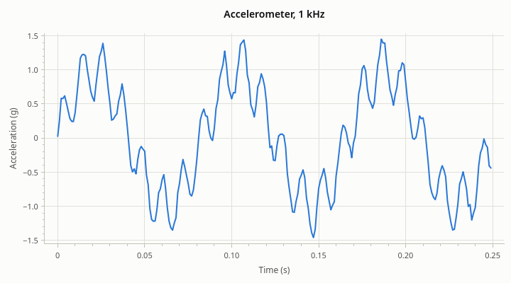
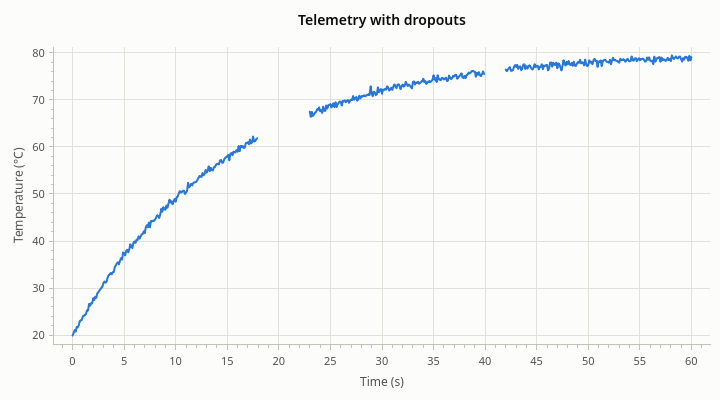
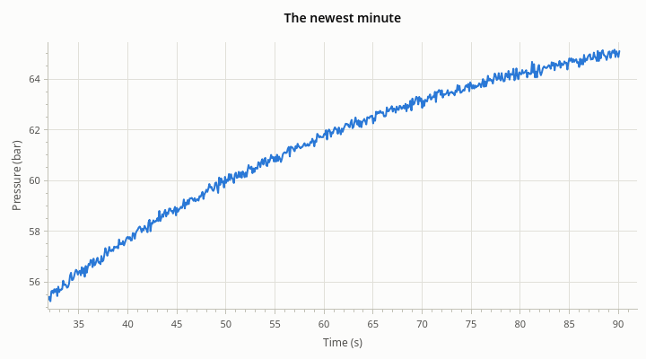

# Data

[User Guide](index.md) · previous: [Getting started](getting-started.md) · next: [Series](series.md)

A series holds points: an x and a y for each. This chapter is about getting them in, changing them, and reading
them back. How the points are drawn is the subject of [Series](series.md).

## Three ways to hand data over

| | What happens | Use it when |
| --- | --- | --- |
| **Copy** | The series makes its own copy, as `double` | The usual case. Your container can change or go away afterwards |
| **Move** | The series takes over your `std::vector<double>` | The data is large and you don't need it yourself any more |
| **View** | The series reads your memory where it is | The data is large and you keep it, or you refill a buffer in place |

### Copy

`addLine()` and `addScatter()` take any *sized range of numbers*: `std::vector`, `std::array`, `std::span`,
`QList`, a C array, of any integer or floating-point type. The values are converted to `double` and copied.

<!-- example: data-copy -->
```cpp
const std::vector<double> time{0.0, 1.0, 2.0, 3.0};
const std::vector<float>  pressure{101.3F, 99.8F, 97.1F, 93.6F};  // any type of number
const std::array<int, 4>  counts{3, 1, 4, 1};
const QList<double>       voltage{4.9, 5.0, 5.1, 5.0};

plot->addLine(time, pressure, "Pressure");  // x and y: copied, as double
plot->addLine(time, voltage, "Voltage");
plot->addScatter(counts, "Counts");  // y alone: x is 0, 1, 2, ...
```

Given only y values, a series uses the index as x: 0, 1, 2, and so on.

`bool` and the character types are not accepted as numbers, so that a string is never taken for data by mistake.

### Move

A `std::vector<double>` passed as an rvalue is taken over without a copy. This matters for millions of points.

<!-- example: data-move -->
```cpp
std::vector<double> x(1'000'000);
std::vector<double> y(1'000'000);
// ... fill them ...
plot->addLine(std::move(x), std::move(y), "Moved in");  // the series takes the vectors over
```

Both x and y must be rvalues of `std::vector<double>` for this; anything else is copied.

### View

`addLineView()` and `addScatterView()` plot memory that stays yours. Nothing is copied, not even once.

<!-- example: data-view -->
```cpp
std::vector<double>     samples(48'000);  // a buffer that the application owns and refills
rocketplot::LineSeries* scope =
    plot->addLineView(rocketplot::UniformX{.start = 0.0, .step = 1.0 / 48'000.0}, samples);

samples[100] = 0.5;          // after changing the buffer in place ...
scope->notifyDataChanged();  // ... tell the series, which reads it again
```

Two rules come with a view:

- **The memory must stay alive and in place** for as long as the series uses it. A `std::vector` that reallocates
  (because it grew) has moved: give the series the new memory with `setDataView()`.
- **Say when you change it.** The series keeps a summary of the data for fast drawing. After writing to the
  memory, call `notifyDataChanged()`, or the plot shows a mix of old and new.

A view can't be appended to: it isn't the series' memory to grow.

## Evenly sampled data

Data sampled at a fixed rate needs no array of x values. `UniformX` gives the x of the first point and the
distance between points; point *i* is at `start + i * step`.



<!-- example: data-uniform -->
```cpp
// 250 samples at 1 kHz: point i is at 0 s + i * 1 ms. No array of x values is stored.
plot->addLine(rocketplot::UniformX{.start = 0.0, .step = 0.001}, samples);
plot->xAxis()->setLabel("Time (s)");
plot->yAxis()->setLabel("Acceleration (g)");
```

This halves the memory of the series, and drawing is a little faster too, because finding the points in view is
arithmetic instead of a search. `UniformX` works with copies, moves and views alike.

## Gaps

A point whose x or y is NaN (or infinite) is a gap. A line breaks there instead of bridging it, and autoscale
ignores the point. Use this for readings that are missing, not for zero.



<!-- example: data-gaps -->
```cpp
// The link dropped out twice: those readings are missing.
const double missing = std::numeric_limits<double>::quiet_NaN();
std::fill(signal.begin() + 180, signal.begin() + 230, missing);
std::fill(signal.begin() + 400, signal.begin() + 420, missing);
plot->addLine(time, signal);
```

A point between two gaps, with no neighbor to connect to, is drawn as a dot so that it doesn't vanish.

## Replacing data

`setData()` gives a series other data and keeps everything else about it: its name, color, legend entry and
place in the drawing order. It takes the same arguments as `addLine()`.

<!-- example: data-replace -->
```cpp
rocketplot::LineSeries* trace = plot->addLine(time, pressure, "Trace");

// Other data, same series.
trace->setData(time, voltage);
// Or with implicit x.
trace->setData(rocketplot::UniformX{.start = 0.0, .step = 0.5}, voltage);
// No points at all.
trace->clear();
```

Replacing a series' data is cheaper than removing the series and adding a new one, and the user's settings for it
(a color they picked from the legend, the fact that they hid it) survive.

Errors, and a scatter series' sizes and colors per point, belong to the points they were set for. Replacing the
data removes them; set them again afterwards. See [Series](series.md#errors).

## Live data

For data that keeps arriving, start with an empty series and `append()` to it.



<!-- example: data-live -->
```cpp
// An empty series to begin with; x shows the newest minute and scrolls as data comes in.
rocketplot::LineSeries* live =
    plot->addLine(std::vector<double>{}, std::vector<double>{}, "Chamber pressure");
plot->xAxis()->setAutoscaleMode(rocketplot::AutoscaleMode::FOLLOW_LATEST);
plot->xAxis()->setFollowWindow(60.0);
plot->yAxis()->setAutoscaleMode(rocketplot::AutoscaleMode::FIT_VISIBLE);
```

The two autoscale modes do the scrolling: `FOLLOW_LATEST` makes the x axis show the newest stretch of data, and
`FIT_VISIBLE` makes the y axis fit what is in that stretch. [Axes](axes.md#autoscale) has the details. When the
user pans or zooms, the axis stops following; a double-click starts it again.

Then add points as they come:

<!-- example: data-append -->
```cpp
// In the GUI thread, whenever readings have arrived: all of them in one call.
live->append(times, readings);

live->append(90.1, 65.1);  // or a single point
```

Three things to know:

- **Append in batches.** One call with twenty points costs far less than twenty calls with one. Collect what
  arrives and append it from a timer, 20 to 60 times a second: the screen doesn't show more than that anyway.
- **Append from the GUI thread.** If the data arrives on another thread, pass it across with a queued signal
  (`Qt::QueuedConnection`) that carries the batch, or put it in a queue that a timer in the GUI thread empties.
- **Appending keeps a sorted series fast.** As long as each new x is not smaller than the last, the series stays
  sorted and only the new points are processed. See [Performance](performance.md).

A series with an x array takes `append(x, y)`. A `UniformX` series takes `append(y)`: the x values continue the
sequence.

A series keeps every point it is given. For a recording that runs for days, decide how much history the plot
needs and replace the data with `setData()` from time to time, or keep the data in a buffer of your own and show
it through a view.

## Reading data back

A series can be asked for what it holds.

<!-- example: data-read -->
```cpp
const rocketplot::LineSeries* series = plot->addLine(time, ascent.velocity, "Velocity");

const std::size_t       count   = series->size();
const double            firstX  = series->x(0);
const double            lastY   = series->y(count - 1);
const rocketplot::Range xBounds = series->xBounds();  // of the points that aren't gaps
const rocketplot::Range yBounds = series->yBounds();

// The point nearest an x value: what the legend reads out at the crosshair.
if (const std::optional<std::size_t> index = series->nearestIndex(150.0))
{
    const double velocityAtCutoff = series->y(*index);
    // ...
}
```

`nearestIndex()` works for series that are sorted by x, and for an x inside the series' range; otherwise it
returns nothing. It is what the legend uses to show values at the crosshair.

## When the arguments are wrong

The data functions throw rather than plot something misleading.

<!-- example: data-mismatch -->
```cpp
QString problem;
try
{
    plot->addLine(std::vector<double>{0.0, 1.0, 2.0}, std::vector<double>{5.0, 6.0});
}
catch (const std::invalid_argument& error)
{
    // x and y must have the same number of values: nothing was added.
    problem = error.what();
}
```

| Exception | When |
| --- | --- |
| `std::invalid_argument` | x and y have different sizes; errors, sizes or colors are not one per point |
| `std::logic_error` | `append()` on a view; `append(x, y)` on a `UniformX` series, or `append(y)` on one with an x array |

Nothing is changed when a function throws.

Next: [Series](series.md), on how the points are drawn.
