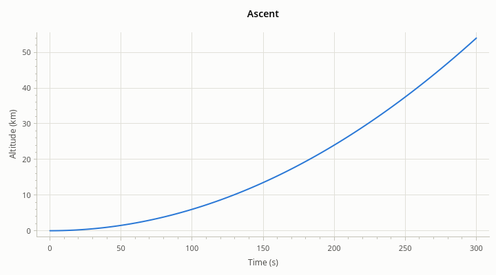
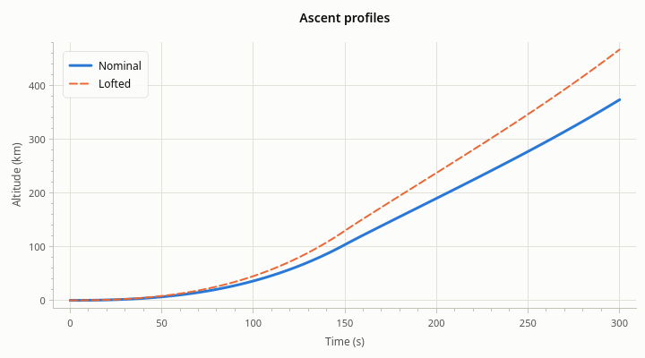

# Getting started

[User Guide](index.md) · next: [Data](data.md)

This chapter adds rocketplot to a CMake project, builds a first program, and names the parts of a plot that the
rest of the guide is about.

## What you need

- Qt 6.8 or later, with its Widgets and Svg modules
- CMake 3.28 or later
- A C++23 compiler: GCC 14, Clang 18, Apple Clang 17 (Xcode 16.3), or Visual Studio 2022 17.7, or later

Your own code must be compiled as C++23 too, because the library's headers use it. Linking the CMake target takes
care of that: it asks for C++23 on whatever links it.

## Adding rocketplot to a project

There are three ways. All of them end with the same line: link your target to `rocketplot::rocketplot`.

### Build it with your project

`FetchContent` downloads the source and builds it as part of your build. Nothing has to be installed first, and
the library is compiled with your compiler and your Qt.

```cmake
include(FetchContent)
FetchContent_Declare(rocketplot
    GIT_REPOSITORY https://github.com/cthunter01/rocketplot.git
    GIT_TAG        main)   # for a build that stays the same, name a release tag or a commit instead
FetchContent_MakeAvailable(rocketplot)

target_link_libraries(my_app PRIVATE rocketplot::rocketplot)
```

If you keep the source in your own tree (a git submodule, a copy), `add_subdirectory(third_party/rocketplot)` does
the same. Either way only the library is built: its tests, demo, documentation and Designer plugin are built only
when rocketplot is the top-level project.

### Use an installed copy

Install the library from its build (`cmake --install build/<preset> --prefix <dir>`), or unpack the `-sdk` archive
of a release into `<dir>`. Then, with `<dir>` in `CMAKE_PREFIX_PATH`:

```cmake
find_package(rocketplot 0.1 REQUIRED)
target_link_libraries(my_app PRIVATE rocketplot::rocketplot)
```

The package finds Qt itself. An installed library was built with one compiler and one Qt: use it with the same
compiler family and with that Qt or a newer one of the same major version.

### Static or shared

The library is static by default. Set `ROCKETPLOT_BUILD_SHARED` to `ON` (or `BUILD_SHARED_LIBS`, which it follows)
for a shared library. Your code is the same either way.

## A first program

A whole program: it makes a plot, gives it a title and axis labels, adds one line, and shows it.

<!-- example: first-plot-program -->
```cpp
#include <QApplication>
#include <vector>

#include "rocketplot/Axis.h"
#include "rocketplot/PlotWidget.h"

int main(int argc, char* argv[])
{
    const QApplication app(argc, argv);

    // Some data: any sized range of numbers will do (std::vector, std::array, QList, ...).
    std::vector<double> time;
    std::vector<double> altitude;
    for (int second = 0; second <= 300; ++second)
    {
        time.push_back(second);
        altitude.push_back(0.0006 * second * second);
    }

    rocketplot::PlotWidget plot;
    plot.setTitle("Ascent");
    plot.xAxis()->setLabel("Time (s)");
    plot.yAxis()->setLabel("Altitude (km)");
    plot.addLine(time, altitude);
    plot.resize(720, 400);
    plot.show();

    return QApplication::exec();
}
```

And the `CMakeLists.txt` that builds it, here with `FetchContent`:

```cmake
cmake_minimum_required(VERSION 3.28)
project(first_plot LANGUAGES CXX)

find_package(Qt6 6.8 REQUIRED COMPONENTS Widgets)

include(FetchContent)
FetchContent_Declare(rocketplot
    GIT_REPOSITORY https://github.com/cthunter01/rocketplot.git
    GIT_TAG        main)
FetchContent_MakeAvailable(rocketplot)

add_executable(first_plot main.cpp)
target_link_libraries(first_plot PRIVATE rocketplot::rocketplot Qt6::Widgets)
```



Without another line of code the plot can already be used:

- **Drag** to move the view; turn the **mouse wheel** to zoom about the pointer.
- **Shift-drag** to zoom to a box.
- **Double-click** to see all the data again.
- **Right-click** for a menu with the view history, the crosshair, and "Copy image" and "Export…".

[Interaction](interaction.md) has the full list and how to change it.

The axes fit the data by themselves, with a little room around it. That is *autoscale*; it stays on until the user
(or your code) picks a range. [Axes](axes.md) covers it.

## The parts of a plot

`PlotWidget` is an ordinary `QWidget`: put it in a layout, a splitter, a dock or a tab like any other. Everything
else hangs off it.



<!-- example: plot-parts -->
```cpp
// The plot makes each series, owns it, and hands back a pointer to set it up with.
rocketplot::LineSeries* line = plot->addLine(time, nominal, "Nominal");
line->setLineWidth(3.0);
plot->addLine(time, lofted, "Lofted")->setLineStyle(Qt::DashLine);

// The axes and the legend are always there.
plot->setTitle("Ascent profiles");
plot->xAxis()->setLabel("Time (s)");
plot->yAxis()->setLabel("Altitude (km)");
plot->legend()->setAnchor(rocketplot::LegendAnchor::TOP_LEFT);
```

| Part | What it is | How you get it |
| --- | --- | --- |
| Series | One data set, drawn as a line or as scatter points | `addLine()`, `addScatter()` return it; `series()` lists them |
| Axes | The x axis, the y axis on the left, and a second y axis on the right | `xAxis()`, `yAxis()`, `yAxis2()` |
| Legend | One entry per named series | `legend()` |
| Annotations | Lines, spans, text and event markers at data coordinates | `addHorizontalLine()`, `addVerticalSpan()`, `addText()`, `addEvent()`, ... |
| Title | A line of text above the plot | `setTitle()` |

A series with a name gets an entry in the legend; one without a name has none. The legend shows up once there are
two entries: a single series is better named by the title.

### Who owns what

The plot owns its series, axes, legend and annotations. They are created by the plot and deleted with it.

- Keep the pointers that `addLine()` and the others return for as long as you need them, to change the series
  later. They stay valid until you remove the series (`removeSeries()`, `clearSeries()`) or the plot is deleted.
- Never `delete` a series, an axis or an annotation yourself. To get rid of a series, call
  `plot->removeSeries(series)`; for an annotation, `plot->removeAnnotation(annotation)`.
- The axes and the legend exist from the start and for the plot's whole life. They can be hidden, not removed.

### Changes show by themselves

There is no "replot" call. Changing anything (data, a color, an axis range) schedules a repaint, and several
changes in a row are drawn once, the next time Qt paints.

### One thread

Like all of Qt's widgets, a plot and everything it owns belong to the GUI thread. Call them only from there. Data
that arrives on another thread has to be handed over first: with a queued signal, or by collecting it and adding
it from a timer in the GUI thread. [Data](data.md#live-data) shows how.

## Where next

- You have data in some container and want it on screen: [Data](data.md).
- You want it to look a certain way: [Series](series.md) and [Appearance](appearance.md).
- You have several channels over the same time: [Several plots](multiple-plots.md).
