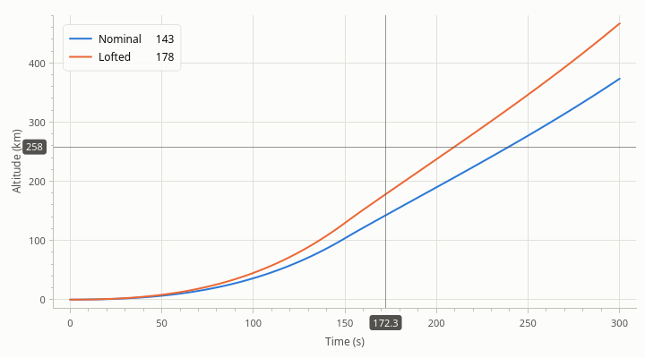

# Interaction

[User Guide](index.md) · previous: [Annotations](annotations.md) · next: [The legend](legend.md)

A plot can be explored with the mouse, a trackpad or a touchscreen without any code. This chapter lists what the
user can do, and how your code can follow along, add to it, or change it.

## What the user can do

| Gesture | What it does |
| --- | --- |
| Drag with the left button | Pan: the view moves with the pointer |
| Shift + drag | Zoom to the box dragged out |
| Mouse wheel | Zoom in and out about the pointer |
| Ctrl + wheel, Shift + wheel | Zoom the x axis only, the y axes only |
| Double-click | Reset the view: every axis back to autoscale |
| Back and forward buttons of the mouse | Step through the view history |
| Two-finger scroll on a trackpad | Pan |
| Ctrl + two-finger scroll | Zoom |
| Pinch (trackpad or touchscreen) | Zoom |
| One-finger drag on a touchscreen | Pan |
| Right-click | The context menu |

Three details make these do what people expect:

- **Over an axis, a gesture applies to that axis alone.** Drag on the x axis to pan in time only; turn the wheel
  over the y axis to zoom y only.
- **A thin zoom box zooms one axis.** Drag a box that is wide but only a few pixels high and the x axis zooms to
  it while y stays as it is; the same for a tall, narrow box and y.
- **Zooming keeps the point under the pointer where it is.**

Panning or zooming an axis turns its autoscale off ([Axes](axes.md#range-and-autoscale)). The double-click turns
it back on.

The legend has gestures of its own; see [The legend](legend.md).

## The view history

Every pan, zoom and reset by the user is a step in the plot's view history, like pages in a browser.

<!-- example: interaction-history -->
```cpp
plot->back();     // the view before the user's last pan, zoom or reset
plot->forward();  // and forward again

// A toolbar button that is only enabled when there is something to go back to.
QObject::connect(plot, &rocketplot::PlotWidget::historyChanged, backButton,
                 [plot, backButton] { backButton->setEnabled(plot->canGoBack()); });
QObject::connect(backButton, &QPushButton::clicked, plot, &rocketplot::PlotWidget::back);
```

- A *view* is the range and the autoscale setting of every axis.
- A burst of wheel steps (less than half a second apart) counts as one step, so one `back()` undoes one zoom,
  however many notches it took.
- The history holds the last 50 views.
- Ranges your code sets (`setRange()`, `restoreState()`) are not recorded. `resetView()` is.
- Linked plots share one history; see [Several plots](multiple-plots.md).

## The crosshair

The crosshair is a pair of lines through the pointer, with the coordinates written on the axes. With it on, each
legend entry also shows its series' value at the pointer's x.



<!-- example: interaction-crosshair -->
```cpp
plot->setCrosshairEnabled(true);  // off by default; the context menu has a switch for it
```

The value in the legend is the y of the series' point nearest to the crosshair's x. It is shown for series that
are sorted by x, and only while the crosshair is within the series' x range.

To show the position elsewhere, such as in a status bar:

<!-- example: interaction-crosshair-signal -->
```cpp
QObject::connect(plot, &rocketplot::PlotWidget::crosshairMoved, status, [plot, status] {
    if (const std::optional<QPointF> at = plot->crosshairPosition())
    {
        status->setText(QString("t = %1 s").arg(at->x(), 0, 'f', 1));
    }
    else
    {
        status->clear();  // the pointer left the plot
    }
});
```

The y of `crosshairPosition()` is on the left y axis. A plot that shows the crosshair of a linked plot
([Several plots](multiple-plots.md)) has an x there but no y of its own: y is NaN.

## Following the view

<!-- example: interaction-view-signal -->
```cpp
QObject::connect(plot, &rocketplot::PlotWidget::viewChanged, status, [plot, status] {
    // The range of an axis changed: by the user, by autoscale or by code.
    const rocketplot::Range shown = plot->xAxis()->range();
    status->setText(QString("Showing %1 s").arg(shown.span(), 0, 'f', 1));
});
```

`viewChanged()` is emitted each time the range of an axis changes, whatever caused it; a pan that moves x and y
emits it twice. Don't change the same plot's ranges from this signal without a guard, or the change calls you
again.

## The context menu

A right-click opens a menu:

- **Back**, **Forward**, **Reset view**
- **Crosshair**, a switch
- **Copy image** and **Export…** ([Export](export.md))

To add entries of your own, connect to `contextMenuAboutToShow`. It hands you the menu, already filled, and where
it was asked for.

<!-- example: interaction-menu -->
```cpp
QObject::connect(plot, &rocketplot::PlotWidget::contextMenuAboutToShow, plot,
                 [plot](QMenu* menu, QPointF position) {
                     // Where the menu was asked for, in data coordinates.
                     const double x = plot->mapToData(position).x();
                     menu->addSeparator();
                     menu->addAction(QString("Mark t = %1 s").arg(x, 0, 'f', 1), plot,
                                     [plot, x] { plot->addEvent(x, "Mark"); });
                 });
```

The menu is deleted when it closes, so add to it each time.

For no menu, set the widget's context menu policy to `Qt::NoContextMenu`; to show a menu that is entirely yours,
set it to `Qt::CustomContextMenu` and handle `QWidget::customContextMenuRequested`, as for any widget.

## Changing what the gestures do

`InputBindings` maps gestures to actions. A binding is a gesture, a mouse button and modifier keys on one side,
and an action on the other.

<!-- example: interaction-bindings -->
```cpp
rocketplot::InputBindings bindings = rocketplot::InputBindings::defaults();
// Zoom to a box with the right button too, and let the wheel zoom the time axis only.
bindings.bind(rocketplot::Gesture::DRAG, Qt::RightButton, Qt::NoModifier,
              rocketplot::PlotAction::BOX_ZOOM);
bindings.bind(rocketplot::Gesture::WHEEL, Qt::NoModifier, rocketplot::PlotAction::ZOOM_X);
// A double click does nothing.
bindings.bind(rocketplot::Gesture::DOUBLE_CLICK, Qt::LeftButton, Qt::NoModifier,
              rocketplot::PlotAction::NONE);
plot->setInputBindings(bindings);
```

| Gesture | Is |
| --- | --- |
| `DRAG` | Press a button and move. A one-finger drag on a touchscreen is the left button |
| `CLICK` | Press and release without moving |
| `DOUBLE_CLICK` | Also a double tap |
| `WHEEL` | A mouse wheel |
| `SCROLL` | Two-finger scrolling on a trackpad |
| `PINCH` | Two fingers moving apart or together |

| Action | Does | For gestures |
| --- | --- | --- |
| `PAN` | Move the view with the pointer | `DRAG`, `SCROLL` |
| `ZOOM`, `ZOOM_X`, `ZOOM_Y` | Zoom about the pointer: all axes, x only, y only | `WHEEL`, `SCROLL`, `PINCH` |
| `BOX_ZOOM` | Zoom to the box dragged out | `DRAG` |
| `RESET` | Back to autoscale | `CLICK`, `DOUBLE_CLICK` |
| `BACK`, `FORWARD` | Step through the view history | `CLICK`, `DOUBLE_CLICK` |
| `NONE` | Nothing: removes the binding | any |

The modifiers must match exactly: a binding for Shift + drag does not fire for Ctrl + Shift + drag. `WHEEL`,
`SCROLL` and `PINCH` have no button; use the overload of `bind()` without one.

If you bind a drag with the right button, the context menu waits for the release and opens only if the pointer
didn't move. If you bind a right *click*, the click does its action instead of opening the menu.

Bindings belong to one plot. To use the same ones everywhere, keep an `InputBindings` object and pass it to each
plot's `setInputBindings()`.

## A plot that is only looked at

For a plot on a dashboard that nobody should be able to shift:

<!-- example: interaction-static -->
```cpp
plot->setInputBindings(rocketplot::InputBindings());  // no gesture does anything
plot->setContextMenuPolicy(Qt::NoContextMenu);        // no menu
plot->legend()->setInteractive(false);                // the legend doesn't react either
```

Next: [The legend](legend.md).
