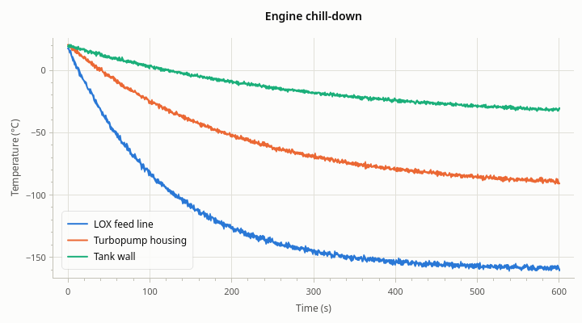
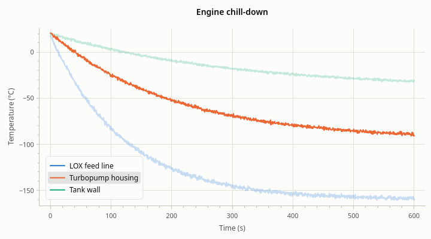

# The legend

[User Guide](index.md) · previous: [Interaction](interaction.md) · next: [Several plots](multiple-plots.md)

The legend lists the plot's named series: a sample of how each is drawn, and its name. It sits inside the plot
area and is also where the user turns series on and off.



There is one legend per plot, there from the start: `plot->legend()`.

## Which series are in it

Every series with a name has an entry, in the order the series were added. A series without a name has none: use
this for series that need no explanation, such as a faint trace of raw samples under a smoothed line.

`series->setName()` changes an entry; an empty name removes it.

## When it shows

By default the legend appears once it has two entries. A plot with a single series is better served by a title
or an axis label that names it.

## Where it goes

The legend starts at `LegendAnchor::BEST`: the corner or edge of the plot area where it covers the least data. It
doesn't jump around as data changes: it moves only when another place is clearly better.

<!-- example: legend-place -->
```cpp
rocketplot::Legend* legend = plot->legend();
legend->setAnchor(rocketplot::LegendAnchor::BOTTOM_RIGHT);  // a corner or the middle of an edge
legend->setAnchor(rocketplot::LegendAnchor::BEST);          // the default: where it hides least

// Anywhere: fractions of the room the plot area leaves around the legend. (0, 0) is the top
// left corner, (1, 1) the bottom right. This is what dragging the legend sets.
legend->setPosition({0.5, 0.0});
```

The anchors are the four corners and the four edges: `TOP_LEFT`, `TOP`, `TOP_RIGHT`, `RIGHT`, `BOTTOM_RIGHT`,
`BOTTOM`, `BOTTOM_LEFT`, `LEFT`. A legend placed by `setPosition()`, or dragged by the user, has the anchor
`CUSTOM`. Because the position is a fraction and not a pixel count, the legend stays inside the plot area when
the window is resized.

## What the user can do with it

| Gesture on an entry | What it does |
| --- | --- |
| Click | Hides the series, or shows it again. The entry stays, dimmed |
| Double-click | Shows only this series; again to show them all |
| Point at it | Brings the series forward and fades the others, to pick one line out of many |
| Right-click | A menu for this series: visible, show only this, show all, color, line width, marker, remove |
| Drag (anywhere on the legend) | Moves the legend |



Hiding a series changes what autoscale fits: hide the one series with large values and the others fill the plot.

**Remove** in an entry's menu deletes the series. If your code keeps pointers to series, connect to the plot's
`seriesRemoved(series)` signal and forget the pointer there, or turn the legend's interaction off.

What the user changes here (hidden series, a color, the legend's place) is part of the plot's state, which you
can save and restore; see [Saving and restoring state](state.md).

## Values at the crosshair

With the plot's crosshair on, each entry shows its series' value at the pointer; see
[Interaction](interaction.md#the-crosshair).

## Settings

<!-- example: legend-options -->
```cpp
legend->setVisible(true);   // show it even for a single series
legend->setVisible(false);  // never show it
legend->resetVisible();     // the default: shown for two or more named series

legend->setValuesVisible(false);  // no values at the crosshair
legend->setInteractive(false);    // no clicking, pointing, dragging or menu
```

A legend that isn't interactive is drawn the same; it only ignores the pointer, so drags over it pan the plot.

## Adding to an entry's menu

The menu that a right-click on an entry opens can take entries of your own.

<!-- example: legend-menu -->
```cpp
QObject::connect(legend, &rocketplot::Legend::entryMenuAboutToShow, plot,
                 [](QMenu* menu, rocketplot::Series* series) {
                     menu->addSeparator();
                     menu->addAction("Copy name", series, [series] {
                         QGuiApplication::clipboard()->setText(series->name());
                     });
                 });
```

The signal comes with the series the entry is for. As with the plot's context menu, the menu is new each time it
opens.

Next: [Several plots](multiple-plots.md).
