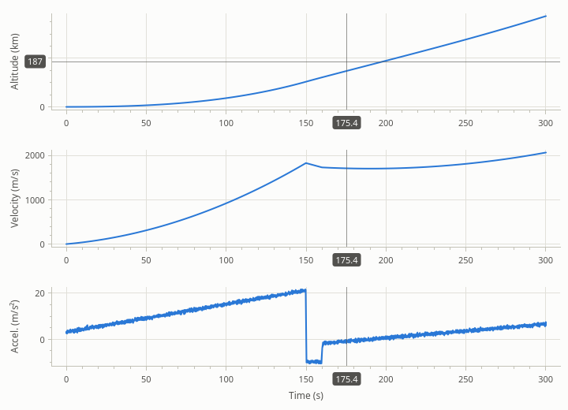
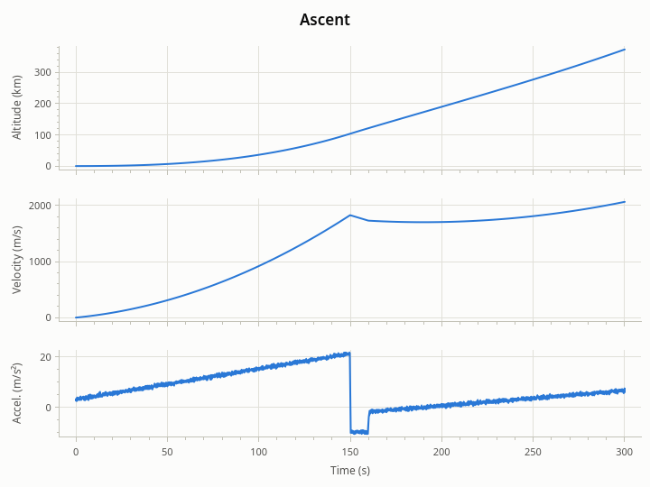
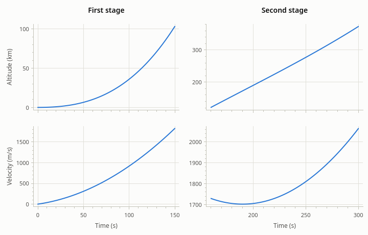

# Several plots

[User Guide](index.md) · previous: [The legend](legend.md) · next: [Appearance](appearance.md)

Channels with different units over the same time read best as plots stacked on one time axis: zoom into a moment
in one and all show that moment. There are two ways to get there.

| | `PlotLink` | `PlotGrid` |
| --- | --- | --- |
| What it is | An object that ties the x axes of plots you made | A widget that makes the plots and arranges them |
| The plots are | Anywhere: your layout, different splitter panes, even different windows | In rows and columns inside the grid |
| Lines up | Left and right edges of the plot areas | The plot areas of every row and every column |
| Exports | Each plot by itself | The whole grid as one figure |

Use a `PlotGrid` when the plots form one figure. Use a `PlotLink` when the plots live in places of their own, or
you need a layout a grid can't give.

## Linking plots

A `PlotLink` takes plots that already exist and ties their x axes together.



<!-- example: multiple-link -->
```cpp
// Three plots of their own, one above the other in a layout.
auto* altitude     = new rocketplot::PlotWidget(window);
auto* velocity     = new rocketplot::PlotWidget(window);
auto* acceleration = new rocketplot::PlotWidget(window);
altitude->addLine(ascent.time, ascent.altitude);
velocity->addLine(ascent.time, ascent.velocity);
acceleration->addLine(ascent.time, ascent.acceleration);
altitude->yAxis()->setLabel("Altitude (km)");
velocity->yAxis()->setLabel("Velocity (m/s)");
acceleration->yAxis()->setLabel("Accel. (m/s²)");
acceleration->xAxis()->setLabel("Time (s)");

// The link ties their x axes together. It belongs to the window, like the plots.
auto* link = new rocketplot::PlotLink(window);
for (rocketplot::PlotWidget* plot : {altitude, velocity, acceleration})
{
    plot->setCrosshairEnabled(true);
    link->addPlot(plot);
    layout->addWidget(plot);
}
```

What the plots of a link share:

- **The x range.** Panning or zooming x in one does the same in the others. A plot that joins takes on the range
  the link has.
- **Autoscale of x.** It fits the data of all the plots, so that they show the same stretch even when one channel
  starts later than another.
- **Margins.** The left and right margins are made equal, so the plot areas line up whatever the width of each
  plot's y labels. This is what makes "the same x is at the same place" true on screen. A plot that is hidden
  takes no part: the others don't keep room for labels nobody sees.
- **The crosshair.** The crosshair of the plot under the pointer shows as a vertical line at the same x in the
  others (those that have their crosshair on), and their legends read out their values there.
- **The view history.** `back()` on any of them undoes the last pan or zoom, in whichever plot it happened.

Each plot keeps its own y axes.

<!-- example: multiple-link-options -->
```cpp
link->setAlignMargins(false);   // each plot keeps the margins its own labels need
link->setLinkCrosshair(false);  // a plot's crosshair doesn't show in the others
link->removePlot(plot);         // the plot goes its own way again
```

A plot belongs to at most one link; adding it to another takes it out of the first. `plot->link()` tells which
link a plot is in. Give the linked x axes the same scale type: a range of a linear axis means little on a
logarithmic one.

A link is a `QObject`. Give it a parent (the window that holds the plots) so that it is deleted with them. Plots
that are deleted leave the link by themselves.

## A grid of plots

A `PlotGrid` is a widget of rows and columns of plots. It makes the plots; you fill them.



<!-- example: multiple-grid -->
```cpp
auto* grid = new rocketplot::PlotGrid(3, 1, parent);  // three rows, one column
grid->setTitle("Ascent");
grid->plot(0)->addLine(time, ascent.altitude);
grid->plot(1)->addLine(time, ascent.velocity);
grid->plot(2)->addLine(time, ascent.acceleration);
grid->plot(0)->yAxis()->setLabel("Altitude (km)");
grid->plot(1)->yAxis()->setLabel("Velocity (m/s)");
grid->plot(2)->yAxis()->setLabel("Accel. (m/s²)");
grid->plot(2)->xAxis()->setLabel("Time (s)");
grid->setCrosshairEnabled(true);  // for every plot
```

`grid->plot(row, column)` gives each plot, counted from the top left; the column can be left out for the first.
Each is a `PlotWidget` like any other, with one restriction: it belongs to the grid, so don't delete it or move it
to another parent.

What the grid does for you:

- **It lines the plot areas up** in both directions: the left edges of a column, the top edges of a row, however
  much room each plot's labels and title take.
- **It links the x axes of each column** with a `PlotLink` of its own, with everything a link brings.
- **It writes the values of a shared x axis once**, under the bottom plot of the column. The plots above keep
  their ticks and grid lines. This leaves more room for the data.
- **It has a title** above all the plots.

### Rows and columns



<!-- example: multiple-grid-columns -->
```cpp
auto* grid = new rocketplot::PlotGrid(2, 2, parent);
grid->plot(0, 0)->setTitle("First stage");
grid->plot(0, 1)->setTitle("Second stage");
// The left column: the first stage's burn. Its two plots share their time axis.
grid->plot(0, 0)->addLine(time.first(cutoff), altitude.first(cutoff));
grid->plot(1, 0)->addLine(time.first(cutoff), velocity.first(cutoff));
// The right column: the second stage's, on a time axis of its own.
grid->plot(0, 1)->addLine(time.subspan(ignition), altitude.subspan(ignition));
grid->plot(1, 1)->addLine(time.subspan(ignition), velocity.subspan(ignition));

grid->plot(0, 0)->yAxis()->setLabel("Altitude (km)");
grid->plot(1, 0)->yAxis()->setLabel("Velocity (m/s)");
grid->plot(1, 0)->xAxis()->setLabel("Time (s)");
grid->plot(1, 1)->xAxis()->setLabel("Time (s)");
```

Here each column has its own time axis: zooming the first stage's burn leaves the second stage's alone.

### Settings

<!-- example: multiple-grid-options -->
```cpp
grid->setXLink(rocketplot::GridLink::ALL);      // every plot on one x axis
grid->setXLink(rocketplot::GridLink::NONE);     // or each on its own
grid->setXLink(rocketplot::GridLink::COLUMNS);  // the default: column by column

grid->setInnerTickLabelsVisible(true);  // the plots above the bottom row label their x axis too
grid->setRowStretch(0, 2);              // the top row twice as tall as the others
grid->setSpacing(8);                    // pixels between neighboring plots
grid->setGridSize(4, 2);                // a fourth row: the plots that exist stay as they are

grid->setThemeMode(rocketplot::ThemeMode::DARK);  // of every plot, and of plots added later
grid->resetView();                                // every axis of every plot back to autoscale
```

- **What is linked.** `COLUMNS` suits channels in rows and cases in columns. `ALL` puts every plot on one x axis.
  With `NONE` the grid only arranges and aligns, and every plot labels its own axis.
- **Size.** `setGridSize()` keeps the plots that are in both the old and the new grid, makes the new ones, and
  deletes the ones that fall outside. Forget your pointers to those.
- **Stretch.** Rows and columns start with equal shares of the grid; a row with stretch 2 gets twice the share of
  one with stretch 1.
- **Theme and crosshair** are set for all plots at once and apply to plots the grid makes later too.

`grid->plots()` lists the plots row by row, and `grid->link(column)` gives the link of a column.

### Exporting and saving a grid

A grid exports as a plot does, as one image or drawing with everything lined up as on screen, and it saves and
restores the state of all its plots in one object.

<!-- example: multiple-grid-output -->
```cpp
// The whole grid as one page, and as one image.
const bool pdfWritten = grid->exportTo(folder.filePath("flight.pdf"));
const bool pngWritten =
    grid->exportImage(folder.filePath("flight.png"),
                      {.size = {900, 700}, .dpi = 200.0, .theme = rocketplot::Theme::print()});

const QJsonObject state = grid->saveState();  // the state of every plot
grid->restoreState(state);
```

See [Export](export.md) for the options and [Saving and restoring state](state.md) for what a state holds.

## Which one to pick

- Channels of one recording, read together and exported together: a `PlotGrid` with one column.
- The same, for several cases side by side: a `PlotGrid` with a column per case.
- An overview plot above a detail plot in a splitter, or plots in separate dock widgets that should scroll
  together: a `PlotLink`.
- Plots that only happen to be next to each other: neither. Put them in a layout.

Next: [Appearance](appearance.md).
