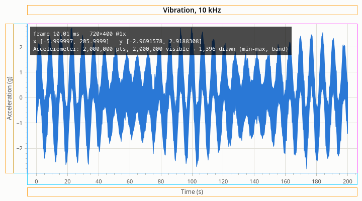

# Performance

[User Guide](index.md) · previous: [Qt Designer](designer.md) · next: [Troubleshooting](troubleshooting.md)

rocketplot is built to stay smooth with millions of points per series. Mostly that just works. This chapter says
how it works, so that you know which few things keep it fast, and how to see what a plot is doing.

## How large data is drawn

A plot area is perhaps 1500 pixels wide. A line of ten million points can't show more than those 1500 columns
can hold, so the library never draws ten million segments.

- **Only the visible stretch is looked at.** For a series sorted by x, the first and last point in view are found
  by a binary search.
- **Each pixel column draws its extremes.** Within one column of pixels, all that can be seen of a dense line is
  how low and how high it goes. The series keeps a summary of its data (the minimum and maximum of blocks of
  points, at several block sizes) that answers "lowest and highest between these two indices" without visiting
  the points. A spike of one sample in ten million still shows, at its full height.
- **The result is cached.** The crosshair, the legend's values and the zoom box are drawn over a picture of the
  data, so moving the pointer doesn't draw the data again.

The cost of a frame therefore depends on the width of the plot in pixels, not on the number of points. The
summary adds a few percent to the data's memory. It is built once, when the data is set, and extended when points
are appended.

## What keeps it fast

### Keep x sorted

Everything above needs the x values to be in order: never decreasing, and without NaN. Time series are. A series
that isn't sorted is still drawn correctly, but every point is visited for every frame, which is fine for
thousands of points and slow for millions.

<!-- example: performance-sorted -->
```cpp
const rocketplot::LineSeries* series = plot->addLine(time, time, "Ramp");
if (!series->isSortedByX())
{
    // x goes back somewhere (or has a NaN): every point is looked at for every frame.
}
```

A series checks this by itself when it gets its data, and keeps checking as points are appended: one point that
goes back in x makes the series unsorted from then on. If your data is a path that really does go back and forth
(a phase plot, a trajectory), that is what it is. If it is a time series with samples out of order, sort it
before plotting.

Gaps are fine: a NaN in **y** does not unsort a series. A NaN in **x** does.

### Don't copy what you don't have to

Copying ten million points takes time and doubles the memory. Move the vectors in, or plot your memory in place;
see [Data](data.md#three-ways-to-hand-data-over). And leave out the x array altogether for evenly sampled data
(`UniformX`), which halves the memory again.

| How the data is handed over | Memory the series uses, per point |
| --- | --- |
| Copy or move, with x values | 16 bytes, plus the summary |
| Copy or move, `UniformX` | 8 bytes, plus the summary |
| View | Only the summary |

### Append in batches

Each append redraws the plot at the next paint. Appending a thousand points one at a time is a thousand small
jobs; appending them in one call is one. Collect incoming samples and append them from a timer, at the rate you
want the screen to update. See [Live data](data.md#live-data).

### Build for release

A Debug build of the library is several times slower than a Release build. Judge speed in the configuration you
ship.

### Things that cost more than they seem

- **Wide or dashed lines over dense, noisy data.** Zoomed in until every sample is its own segment, a noisy
  series has thousands of sharp corners, and stroking them wide or dashed is slow. Thin, solid lines are the
  cheapest.
- **Very large unsorted scatter series.** See above: every point is visited.
- **Many plots that all change at once.** Each plot draws its own data. Twenty plots that each get new data sixty
  times a second are twenty redraws per frame. Update less often, or show fewer at a time.

Things that are cheap, in case you wondered: hidden series (not drawn at all), markers on a dense line (left out
until the points are apart), error bands on sorted series (drawn from summaries, like the data), linked plots and
grids, annotations, the crosshair.

## Seeing what a plot does

### The debug overlay

The overlay draws over the plot what the last frame cost and what each series drew.



<!-- example: performance-overlay -->
```cpp
plot->addLine(rocketplot::UniformX{.start = 0.0, .step = 1.0 / 10'000.0}, std::move(samples),
              "Accelerometer");
plot->setDebugOverlay(true);  // or run with ROCKETPLOT_DEBUG_OVERLAY=1 in the environment
```

The environment variable turns it on for every plot of an application without a rebuild.

What it shows:

- **`frame … ms   720×400 @1x`**: how long the last full drawing of the plot took, its size, and the screen's
  scale factor. 16 ms is 60 frames a second.
- **`x [...]   y [...]`**: the ranges in view.
- **One line per series**: how many points it has, how many are in view, and how many were drawn. In the figure,
  two million points were drawn as about 1,400.
- **How it was drawn**: `raw` (few enough points to draw them all), `min-max` (the extremes per pixel column),
  or `pixel-skip` (an unsorted series, every point visited). `band` means the line was dense enough to fill as a
  band; `stroked` that it was drawn as a line.
- **Colored outlines** around the parts of the layout: the title, the axes' labels and ticks, the plot area.

If a plot feels slow, look here first. `pixel-skip` on a large series says it is unsorted. A large frame time with
small "drawn" numbers points at something other than the data.

### Logging

The library logs what it does through Qt's logging categories, off by default.

| Category | Logs |
| --- | --- |
| `rocketplot.render` | Each frame's time |
| `rocketplot.input` | Pans, zooms, resets |
| `rocketplot.data` | Data being set and appended, and whether the series is sorted |

Turn them on without a rebuild with `QT_LOGGING_RULES="rocketplot.*.debug=true"` in the environment, or in code:

<!-- example: performance-logging -->
```cpp
// What the library does, on Qt's debug output: frame times, pans and zooms, data arriving.
QLoggingCategory::setFilterRules(
    "rocketplot.render.debug=true\n"
    "rocketplot.input.debug=true\n"
    "rocketplot.data.debug=true");
```

### Benchmarks

The repository has benchmarks of whole frames and of the parts underneath (`cmake --workflow --preset bench`).
They are the place to check a change to the library itself; the [README](../../README.md#benchmarks) says how to
run them.

Next: [Troubleshooting](troubleshooting.md).
