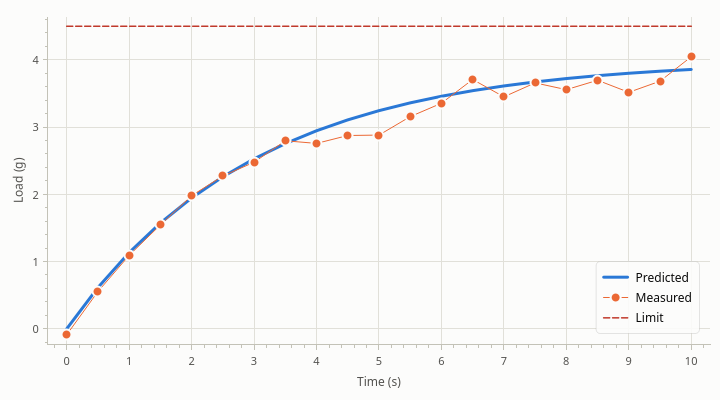
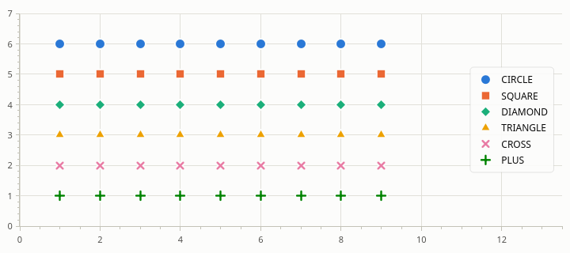
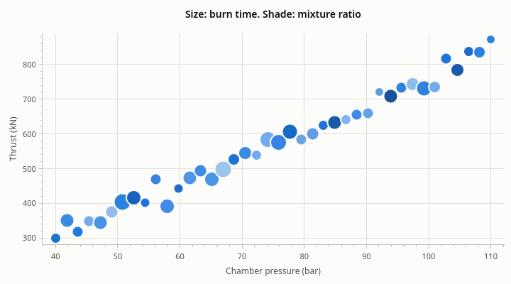
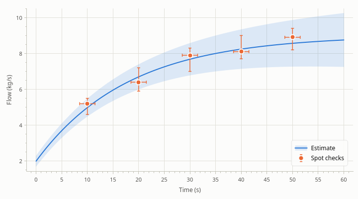

# Series

[User Guide](index.md) · previous: [Data](data.md) · next: [Axes](axes.md)

There are two kinds of series. A `LineSeries` connects its points; a `ScatterSeries` draws a marker at each.
Both are a `Series`, which is where the data, the name, the color and the errors live. This chapter is about how
they look.

## Lines

`addLine()` returns a `LineSeries`. Its line has a width and a style, and it can have markers too.



<!-- example: series-lines -->
```cpp
rocketplot::LineSeries* model = plot->addLine(time, predicted, "Predicted");
model->setLineWidth(3.0);  // device-independent pixels

rocketplot::LineSeries* samples = plot->addLine(time, measured, "Measured");
samples->setMarker(rocketplot::Marker::CIRCLE);  // a marker at each point
samples->setLineWidth(1.0);

rocketplot::LineSeries* ceiling = plot->addLine(time, limit, "Limit");
ceiling->setPen(QPen(QColor("#c0392b"), 1.5, Qt::DashLine));  // color, width and style at once
```

- **Width** is in device-independent pixels, like everything else you size: 2 by default (from the theme), and
  the same on a high-DPI screen, only sharper.
- **Style** is a `Qt::PenStyle`: `Qt::SolidLine`, `Qt::DashLine`, `Qt::DotLine`, `Qt::DashDotLine`.
- **Markers on a line** show only while the points are far enough apart to tell them from each other. Zoomed out
  over thousands of points they would merge into a thick smear, so the line is drawn alone; zoom in and they
  appear.

## Scatter points

`addScatter()` returns a `ScatterSeries`: a marker per point, circles by default, and no line.



<!-- example: series-markers -->
```cpp
const std::vector<rocketplot::Marker> shapes{
    rocketplot::Marker::CIRCLE,   rocketplot::Marker::SQUARE, rocketplot::Marker::DIAMOND,
    rocketplot::Marker::TRIANGLE, rocketplot::Marker::CROSS,  rocketplot::Marker::PLUS,
};
const std::vector<QString> names{"CIRCLE", "SQUARE", "DIAMOND", "TRIANGLE", "CROSS", "PLUS"};
for (std::size_t i = 0; i < shapes.size(); ++i)
{
    const std::vector<double>  y(x.size(), static_cast<double>(shapes.size() - i));
    rocketplot::ScatterSeries* points = plot->addScatter(x, y, names[i]);
    points->setMarker(shapes[i]);
    points->setMarkerSize(11.0);  // the diameter, in device-independent pixels
}
```

Each marker has a thin ring in the background color around it, so that markers that overlap can still be told
apart.

### A size and a color per point

A scatter series can show a third and a fourth value: as the size of each marker, and as its color.



<!-- example: series-bubbles -->
```cpp
rocketplot::ScatterSeries* firings = plot->addScatter(pressure, thrust, "Test firings");

// A third value as the marker's area: pass diameters, so the square root of the value.
std::vector<double> diameters;
diameters.reserve(burnTime.size());
for (const double seconds : burnTime)
{
    diameters.push_back(4.0 * std::sqrt(seconds));
}
firings->setSizes(diameters);

// A fourth as its color: one hue from light to dark, low to high.
std::vector<QColor> colors;
colors.reserve(mixture.size());
for (const double ratio : mixture)
{
    const double level = std::clamp((ratio - 1.8) / 1.2, 0.0, 1.0);
    colors.push_back(QColor::fromHslF(0.59F, 0.75F, static_cast<float>(0.82 - (0.52 * level))));
}
firings->setColors(colors);
```

- `setSizes()` takes one diameter per point, in pixels. People compare markers by area, so for a value to be
  read as "twice as much", pass the square root of it, scaled to taste. A point with a size that isn't a positive
  number is not drawn.
- `setColors()` takes one color per point: `QColor`, `QRgb` or `Qt::GlobalColor`. For a value on a scale, use one
  hue from light to dark, as here; a rainbow hides the order of the values.

The library doesn't draw a key for sizes or colors. Say what they mean in the title, a label or the text beside
the plot.

Like errors, sizes and colors belong to the points they were set for. `clearSizes()` and `clearColors()` go back
to the series' own.

## Color

A series gets its color from the plot's theme: the first series the first color of the theme's palette, the second
the second, and so on. Those colors change with the theme, so a plot stays readable when the application switches
to dark mode. The palette's order was chosen so that neighbors stay distinguishable with the common forms of
color blindness.

<!-- example: series-color -->
```cpp
rocketplot::LineSeries* line = plot->addLine(x, y, "Tank pressure");
line->setColor(QColor("#8e44ad"));  // this color, whatever the theme
line->resetColor();                 // back to the theme's color for this series
```

Set a color only when it means something (red for a limit, the color a channel has everywhere in your
application). A color you set stays as it is in every theme, so check it on both a light and a dark background.

A series keeps its color when others are removed: the third series stays green when the first is deleted.

## Errors

Any series can have an error for each point: along y, along x, or both.



<!-- example: series-errors -->
```cpp
// The same error below and above each point. A line shows y errors as a band.
plot->addLine(time, estimate, "Estimate")->setYErrors(sigma);

// Different errors below and above. A scatter series shows them as bars.
rocketplot::ScatterSeries* checks = plot->addScatter(checkTime, checkValue, "Spot checks");
checks->setYErrors(below, above);
checks->setXErrors(std::vector<double>(checkTime.size(), 1.5));  // and along x
```

- One array gives the same error below and above; two give them separately. Signs are ignored, and a NaN means
  "no error for this point".
- **Lines** draw y errors as a shaded band, **scatter series** as bars with caps. `setErrorStyle()` switches.
- **x errors** are always bars.
- Autoscale makes room for the errors, not only for the points.
- Where bars are too dense to tell apart (a sorted series zoomed far out), they are drawn as a band, and become
  bars again as you zoom in.

<!-- example: series-errors-style -->
```cpp
line->setYErrors(std::vector<double>{0.2, 0.3, 0.2});
line->setErrorStyle(rocketplot::ErrorStyle::BARS);  // bars on a line; BAND is its default
line->setErrorCapSize(10.0);                        // width of the caps; 0 for none
line->setBandOpacity(0.25);                         // of a band: 0 to 1
line->clearErrors();
```

A band needs the series to be sorted by x; on an unsorted series bars are drawn whatever the style says.

Errors belong to the points the series has when they are set. After `setData()` they are gone, and appended
points have none until you set the errors again (for all points).

## Showing, hiding, renaming, removing

<!-- example: series-visible -->
```cpp
line->setVisible(false);  // not drawn, not autoscaled to; its legend entry is dimmed
line->setName("Tank pressure (bar)");
plot->removeSeries(line);  // gone for good: the pointer is dangling now
plot->clearSeries();       // all of them
```

A hidden series keeps its data and its legend entry (dimmed), and autoscale ignores it. The user does the same by
clicking the entry; see [The legend](legend.md).

Series are drawn in the order they were added, the last on top.

## Which y axis

A series is measured against the left y axis unless you say otherwise: `series->setYAxis(plot->yAxis2())` puts it
on the right one. See [Axes](axes.md#a-second-y-axis).

## Signals

Every series has two signals: `changed()` when a style property changes (name, visibility, color, marker, ...),
and `dataChanged()` when its data or errors do. The plot tells you when series come and go with
`seriesAdded(series)` and `seriesRemoved(series)`; the second is your cue to forget the pointer.

Next: [Axes](axes.md).
